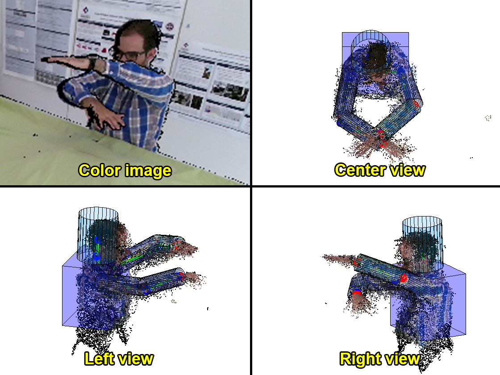
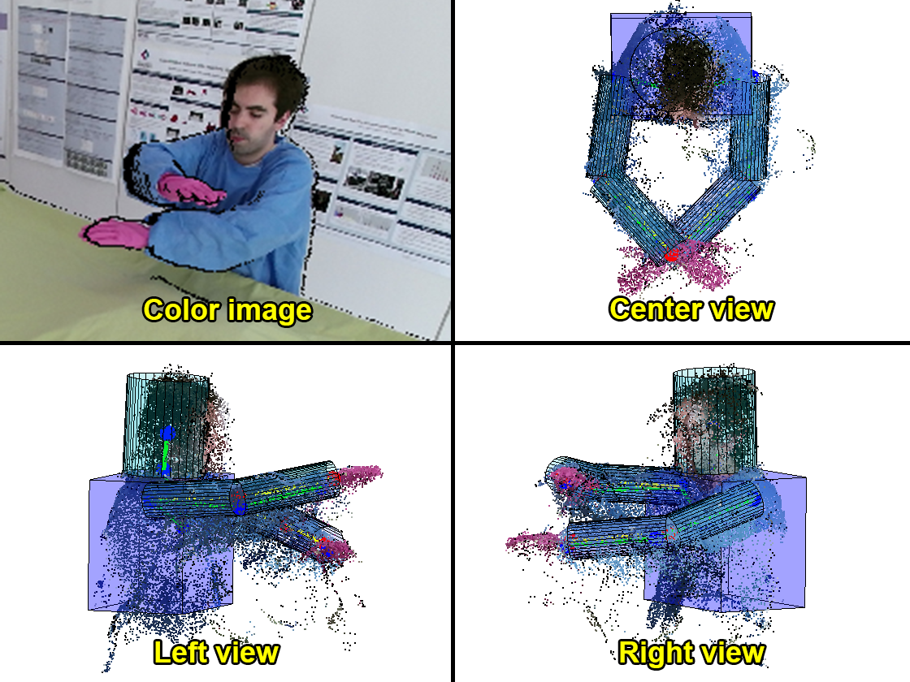

# Tracking People and Arms in Robot Surgery Workcell Using Multiple RGB-D Sensors

This reporitory contains the Matlab code of my dissertation for the MSc in Artificial Intelligence at the university of Edinburgh.

## Some results
#### Example 1

  

#### Example 2

  

A better view can be seen in the following video:

[https://www.youtube.com/watch?v=RZFBXTjE8Ik&t=1s](https://www.youtube.com/watch?v=RZFBXTjE8Ik&t=1s)

## Demo
The directory named _DEMO_ contains a small sample of the final results obtained, where you can inspect the point cloud  of the person and the skeleton, fitted using particle filters.

In order to run the program, you will need to download [this file](https://drive.google.com/open?id=1s2kcnXTETLFNtLiRZV9HDXFgKQD1qyS1) (286Mb) and add it to the _DEMO_ directory.

More detail instructions can be found inside the script `DEMO.m`, but you just basically need to run all the lines inside it.

---------------------------------------------------------------------------------------------------------
## More detailed documentation

The project is divided into three parts:
- pre-processing
- detection
- tracking

The main script of the project is `main.m`. This script calls the rest of the scripts.

Inside the `main.m` script, two main scripts are called:
- `main_create_pcl.m`
- `main_particle_filter.m`

The first one handles the pre-processing stage and the detection part.
The second one takes care of the tracking part.

---------------------------------------------------------------------------------------------------------
`main_create_pcl.m` calls the following relevant scripts:
- `personDetectionAllFrames.m`: detects the person using color (blue gown and pink gloves) and depth (region growing algorithm)
- `personDetectionAllFramesNoColorBack.m`: detects the person using only depth (background subtraction method)

---------------------------------------------------------------------------------------------------------
`main_particle_filter.m` calls the following relevant scripts:
- `particle_filter_rshoulder.m`
- `particle_filter_relbow.m`
- `particle_filter_lshoulder.m`
- `particle_filter_lelbow.m`

These four scripts contain the particle filters for each joint to be tracked. They could be joined as one in future improvements.

The rest of the scripts are called by one or more of the scripts described here.
